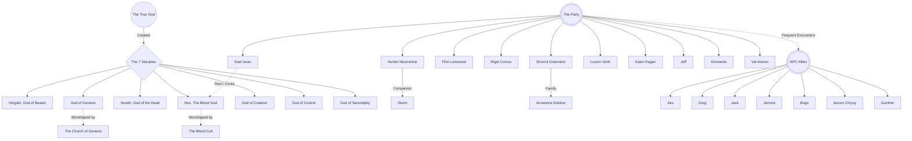

# Global Relationship Tree

This flowchart visualizes the connections between the gods, the major factions, the PCs, and their allies.

```mermaid
graph TD
    %% Deities
    TG((The True God)) -->|Created| Disciples{The 7 Disciples}
    Disciples --> GodBeasts[Vorgath, God of Beasts]
    Disciples --> GodGen[God of Genesis]
    Disciples --> GodDead[Sereth, God of the Dead]
    Disciples --> BloodGod[Nex, The Blood God]
    Disciples --> GodCreation[God of Creation]
    Disciples --> GodControl[God of Control]
    Disciples --> GodSeren[God of Serendipity]
    
    %% Factions
    BloodGod -.->|Worshipped by| BloodCult[The Blood Cult]
    GodGen -.->|Worshipped by| GenesisChurch[The Church of Genesis]
    
    %% PCs
    PCs(((The Party)))
    PCs --> Kael[Kael Issac]
    PCs --> Hunter[Hunter Moonshine]
    PCs --> Flint[Flint Lockwood]
    PCs --> Rigel[Rigel Corvus]
    PCs --> Strarrul[Strarrul Greenskin]
    PCs --> Lucien[Lucien Vorth]
    PCs --> Kaien[Kaien Kagari]
    PCs --> Jeff[Jeff]
    PCs --> Kirmanda[Kirmanda]
    PCs --> Valac[Val Averen]
    
    %% Specific PC Connections
    Kael -.->|Pact / Curse| BloodGod
    Hunter -->|Companion| Storm[Storm]
    Strarrul -->|Family| Annanora[Annanora Solstice]
    
    %% Allies
    PCs -.->|Frequent Encounters| Allies(((NPC Allies)))
    Allies --> Aku[Aku]
    Allies --> Greg[Greg]
    Allies --> Jack[Jack]
    Allies --> Jerome[Jerome]
    Allies --> Bogo[Bogo]
    Allies --> Aurum[Aurum Chrysy]
    Allies --> Gunther[Gunther]
```
