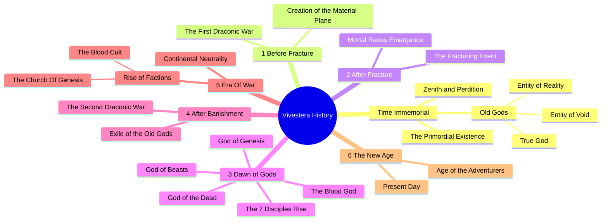

# History & Timeline Mindmap

This mindmap provides a visual overview of the major historical eras and events in Vivestera.

```mermaid
mindmap
  root((Vivestera History))
    Time Immemorial
      The Primordial Existence
      Zenith and Perdition
      Old Gods
        True God
        Entity of Reality
        Entity of Void
    1 Before Fracture
      Creation of the Material Plane
      The First Draconic War
    2 After Fracture
      The Fracturing Event
      Mortal Races Emergence
    3 Dawn of Gods
      The 7 Disciples Rise
      God of Beasts
      God of Genesis
      The Blood God
      God of the Dead
    4 After Banishment
      The Second Draconic War
      Exile of the Old Gods
    5 Era Of War
      Continental Neutrality
      Rise of Factions
        The Blood Cult
        The Church Of Genesis
    6 The New Age
      Present Day
      Age of the Adventurers
```
